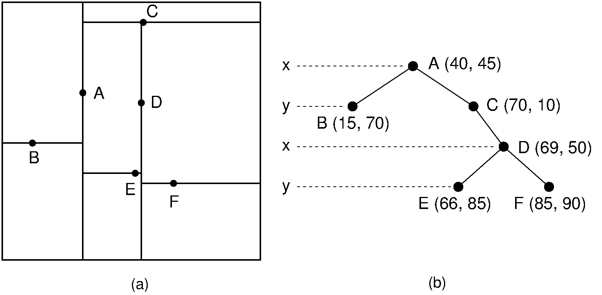
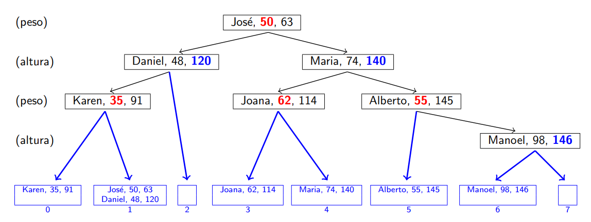
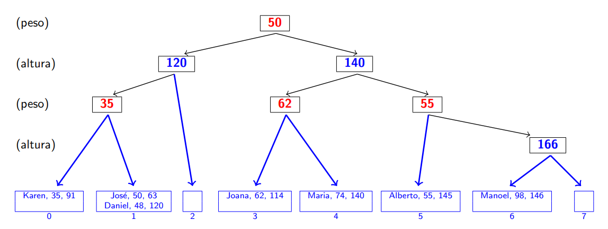

### Universidade Federal da Bahia
##### Departamento de Ciência da computação
#### Aluna: Alana Bispo de Souza
#### Professor: Flávio de Assis

---

## MATA54 - Estrutura de Dados e Algoritmos II
### Trabalhos 3 e 4 - Arvore K-D com busca de texto

[](https://gitpod.io/#https://github.com/alanabispo/MATA54-trabalho3-4)


## Introdução

Este trabalho possui a implementação de uma árvore k-d com busca de texto
para um sistema hipotético de uma biblioteca ou outra aplicação que envolva
o armazenamento de livros e a busca de uma expressão de texto dentro destes
livros.

### Estrutura dos arquivos e pastas

```
- docs/    = Outros anexos para a documentação do trablaoh
- scripts/ = Pasta com scripts para ajudam a debugar o projeto e criar representações
- lib/     = Outros códigos fontes auxiliares ao projeto
- main.c   = Entrypoint do trabalho 4
- main_trab3.c = Entrypoint do trabalho 3
- *_test.c = Arquivo com testes unitários referentes ao arquivo sem o sufixo
```

Uma árvore k-d (onde k é o número de dimensões) é uma estrutura de dados que combina
o conceito básico de uma árvore de busca binária com dois filhos cada nó, com a 
possibilidade de se ter mais que uma dimensão, daí a variável 'k' em seu nome. 

Para este trabalho foi definido em sua especificação que iremos utilizar uma árvore 
bidimensional, ou seja, uma árvore 2-d.


##### **Figura 1.** Exemplo de árvore 2-d com duas dimensões. (a) Representação cartesiana (b) Representação em formato de árvore de busca binária

Para facilitar as demais definições neste documento iremos convencionar que:

* **Eixo X** - Irá representar os níveis **ímpares** da árvore
* **Eixo Y** - Irá representar os níveis **pares** da árvore

Esta definição irá ajudar nas representações da árvore que iremos ver a seguinte
com exemplos reais da estrutura de dados que construí com base na especificação do trabalho.

Árvores k-d tem como vantagem permitir buscas com mais do que uma chave e buscas em intervalos
tendo um menor custo que uma busca linear, porém possibilitando ter mais do que apenas uma 
dimensão. O modelo especificado para este trabalho é de uma árvore 2-d com o armazenamento dos
registros em páginas.

Uma página de uma árvore k-d é uma estrutura que armazena um vetor de registros dentro de um arquivo.
Cada uma dessas páginas pode armazenar até N registros (valor definido pela macro NREGSPORPAGINA).
No caso de não existir mais espaços disponíveis no registro a página irá atuar como uma lista 
encadeada simples, utilizando apenas um ponteiro para o próximo item da lista. 



##### **Figura 2.** Exemplo de estrutura similar

É importante lembrar que como o único dado importante para cada nível é o item a ser comparado
nossa estrutura de indices não irá conter nenhuma outra informação além do próprio índice, ou seja,
nossa estrutura será semelhante à próxima imagem sem as informações do registro no nível:



Abaixo apresento as estruturas utilizadas para os **Registros**, **Índices** e **Páginas**:

### Estrutura - Registro

```c
typedef struct {
    char nome_autor[TAMANHO_MAX_STRING + 1]; // Adiciona +1 caractere para o \0
    char titulo[TAMANHO_MAX_STRING + 1];
    int ano;
    char nome_arquivo[TAMANHO_MAX_STRING + 1];
} Registro;
```

### Estrutura - Índice

```c
/**
 * Define os tipos que um determinado nó de indice pode ter:
 *  - IMPAR = nome_autor
 *  - PAR = ano
 */
typedef enum {
    NO_IMPAR = 0,
    NO_PAR,
    NO_VAZIO
} TiposNosIndice;

/**
 * Tipo apontamento que um índice pode utilizar
 */
typedef enum {
    APONTAMENTO_INDICE = 0,
    APONTAMENTO_PAGINA,
    APONTAMENTO_VAZIO
} TipoApontamento;

typedef struct {
    // Armazena a propriedade principal em relação ao tipo do nó
    union {
        char nome_autor[TAMANHO_MAX_STRING + 1];
        int ano;
    };

    // Tipo do nó
    TiposNosIndice tipo;

    // Nível do nó
    int nivel;

    // Apontadores para os nós filhos do nó atual
    int direita;
    int esquerda;

    // Tipos dos apontadores
    TipoApontamento tipo_direita;
    TipoApontamento tipo_esquerda;
} NoIndice;
```

### Estrutura - Página

```c
typedef struct {
    int n_registros;
    int prox_pagina;
    Registro registros[NREGSPORPAGINA];
} PaginaRegistros;
```

### -------- !!!!!!!!! TODO: EXPLICAR SOBRE A BUSCA DE TEXTO E OS INDICES !!!!!!!!! --------

## Requisitos

Para a correta execução desse projeto são necessários os seguintes programas:

* **GCC** v8.xx.xx (ou superior) - (foi testado usando v12.1.0)
* **GNU Make** v4.2 (ou superior) - (foi testado usando v4.3)
* **CMake** (opt) v3.21.xx (ou superior) - (foi testado usando v12.1.0)
* **CLang** (opt) v8.xx.xx (ou superior) - (foi testado usando v13.0.1)
* **Python** (opt) v3.8.xx (ou superior) - (foi testado usando v3.10.4)

**Obs.:** Não foram utilizados recursos novos das aplicações acima que justifiquem 
versões mais novas destas. Os requisitos acima são apenas um pequeno guia para atestar
quais recursos e em que versões é **garantido** seu correto funcionamento. Apesar disso
é esperado que a aplicação funcione com versões inferiores às informadas. 

**Obs. 2:** (opt) = Opcional

**Tenha os requisitos independentemente das versões informadas acima.**
**Utilize as recomendações de versão caso tenha problemas durante o build.**

## Build

### -------- !!!!!!!!! TODO: EXPLICAR SOBRE BUILD !!!!!!!!! --------

## Execução

### -------- !!!!!!!!! TODO: EXPLICAR MENU E O QUE ESPERAR !!!!!!!!! --------

### Exemplo de entada 1

```
3
alana
persistencia
2014
x.txt
clara
amor
2015
y.txt
poli
familia
2022
z.txt
```

## Testes

### -------- !!!!!!!!! TODO: EXPLICAR SOBRE OS TESTES UNITÁRIOS !!!!!!!!! --------

## Sobre o desenvolvimento

Criado por **Alana Bispo** ([@alanabispo](https://github.com/alanabispo)) com <3 em **Salvador-BA** para a disciplina **MATA54**
(Estrutura de Dados e Algoritmos II) ministrada pelo professor **Flávio Assis** ([@fassis](http://www.academo.ufba.br/pesquisador.php?cod=1026))
na **Universidade Federal da Bahia ([UFBA](https://ufba.br))**.